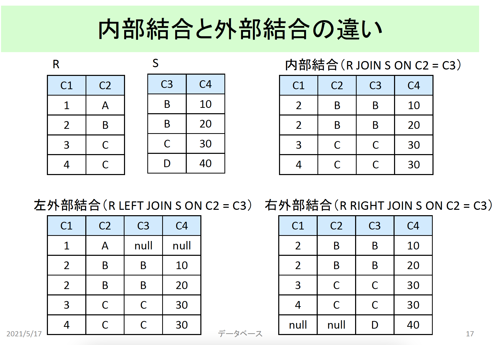

# 6回目 集合演算

## 述語

- 戻り値が真理値となる条件式
- 主にWERE句で使用

---

- BETWEEN: 範囲（上限と下限を含む）
- LIKE: 文字列の部分一致
- IS NULL, IS NOT NULL: NULL判定
- IN, ANY, ALL: 集合の要素判定（OR/AND）
- EXISTS: 存在判定

### 述語の作用対象

- スカラ値
  - 比較演算子
  - 範囲指定（BETWEEN）
  - 文字列の部分一致（LIKE）
  - NULL値の判定（IS NULL, IS NOT NULL）
- 集合
  - OR, AND...

### 文字列の部分一致

- 前方一致

  ```sql
  大学名 like'東京電機%' -- 東京電機hoge
  ```

- 後方一致

  ```sql
  大学名 like'%電機大学' -- hoge電機大学
  ```

- 中間一致

  ```sql
  大学名 like'%電機%' -- hoge電機foo
  ```

- ワイルドカード文字
  - 任意の1文字: `_`
  - 任意の複数文字: `%`

## 集合演算

- 和両立
  - 列の数が等しい
  - 対応する各列のデータ型が等しい
  - 列の名前は異なっていても良い
- 集合演算の種類
  - 和集合（UNION）
  - 共通集合または積集合（INTERSECT）
  - 差集合（EXCEPT）

## 結合演算

- 種類
  - 結合（join）/内部結合（inner join）
  - 左外部結合（left outer join）
  - 右外部結合（right outer join）
  - 直積（cross join）

### 自己結合

- 1つのテーブルを同じselect文中で2回以上使うこと
- テーブル名と列名が重複するので、別名を使用する必要あり


